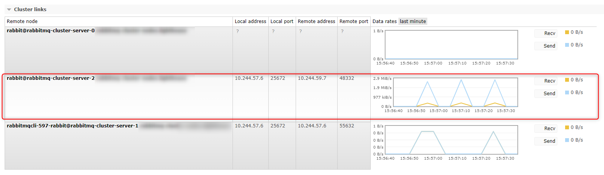

# Restart cluster

Restart the cluster is quite normal operation. It will happend when you e.g.
upgrade image of rabbitmq or change any settings. 
It should go one by one as rolling update. 
It can be long (even 7 days per pod)

Below there is procedure that can speed you up and give you hints what is happening.

## 0. Be patient

It can be long. But behind of the scene a lot is happening. 
Don't kill pods with force unless you are sure that everything is synced.

## 1. It is so long (even 7 days per pod). Why?

Termination Grace Period Timeout is is `604800` - `7 days` [docs](https://www.rabbitmq.com/kubernetes/operator/using-operator#TerminationGracePeriodSeconds).
>TerminationGracePeriodSeconds is the timeout that each rabbitmqcluster pod will have to run the container preStop lifecycle hook to ensure graceful termination. The lifecycle hook checks quorum status of existing quorum queues

On running node we can run this script [check_if_node_is_quorum_critical](https://www.rabbitmq.com/docs/man/rabbitmq-queues.8#check_if_node_is_quorum_critical)
and verify how this node is synced
```bash
rabbitmq-queues check_if_node_is_quorum_critical
```

## 2. Close connections on the terminating pod

In our case closing connections to particular node that is terminating state start output logs like this:
```log
rabbitmq <concrete-date> [info] <0.24591.3> queue '<queue-name>' in vhost '<vhost-name>': term mismatch - follower had entry at <number> with term <number> but not with term <number>
rabbitmq <concrete-date> [info] <0.24591.3> Asking leader {'<queue-name>','<one of the server nodes>'} to resend from 307
```

How to do it?

Use rabbitmqctl from one of the rabbitmq pods:

```bash
# e.g. for node name: rabbit@server-1.rabbitmq-cluster-nodes.local
rabbitmqctl --node rabbit@server-1.rabbitmq-cluster-nodes.local close_all_connections "Reason - termination of node"
```

## 3. See progress of termination - set log level

Let's assume there are two nodes `rabbit@server-0.rabbitmq-nodes.local` is in `Terminated` state and `rabbit@server-1.rabbitmq-nodes.local` running. 
You don't see that something is happening on `rabbit@server-0.rabbitmq-nodes.local`.
You can log in into running node and run command:
```bash
rabbitmqctl --node rabbit@server-0.rabbitmq-nodes.local set_log_level debug
```
After that you can observe logs of your pods
```bash
kubectl logs -n <namespace> <rabbitmq-pod-name>
```

You can also observe that pod in `terminating` (in our case `server-1`) state is sending state with living pods.
In management UI go to `Overview` -> `Nodes` -> `<your-node>` -> `Cluster links`
You will see `Send` peaks that `terminating` pods are doing to others.



