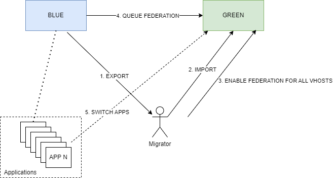

# Instruction to upgrade RabbitMQ from 3.8.x to latest version

## Blue/green deployment

Glossary:
- `blue` - rabbitmq cluster with old version
- `green` - cluster cluster with newest version



### Overall view

1. Spin new `green` cluster (with `federation` plugin enabled)
2. Export rabbitmq definition for vhosts, users, policies, bindings, exchanges, queues from `blue` cluster
3. Make appropriate changes in definition e.g. change classic queues to quorum
4. Import changed definition to `green` cluster
5. Verify that it has succeeded: users login, queues, vhosts etc.
6. Enable federation plugin on `blue` cluster
7. Start federation on the `green` cluster for all vhosts
8. Ensure that all messages are gone from `blue` cluster.  
  It can be done e.g. vhost by vhost.  
9. Disable federation from `green` cluster
10. Delete `blue` cluster

### Scripts to automate deployment

In `blue-green-migration` directory there is a package of scripts to automate migration
- `.env` - contains all needed configuration: hosts, auth etc. Need to be filled out with proper configuration
- `check_connectivity.sh` - script verify if configuration in  `.env` file is correct
- `change_queue_definitions_to_quorum.sh` - script changes classic queues to quorum.
- `install_dependencies.sh` - script instal all needed dependencies for other scripts
- `rabbitmq_api_utils.sh` - library with all rabbitmq functions; referenced by other scripts
- `enable_federation.sh` - enable federation on green cluster for single vhost. vhost provided as an argument
- `enable_federation_for_all.sh` - enables federation on green cluster for all vhosts from green cluster
- `disable_federation.sh` - disable federation on green cluster for single vhost. vhost provided as an argument
- `disable_federation_for_all.sh` - disable federation on green cluster for all vhosts from green cluster
- `delete_vhost.sh` - delete vhost from blue cluster. vhost provided as an 
- `enable_max_error_queue_size_for_all.sh` - enables max error queue size policy on green cluster for all vhosts
- `blue_green_dpeloyment.sh` - complete blue-green deployment. It migrate configuration from blue cluster to green and set up federation for all vhosts.
- `backup_and_restore.sh` - backup configuration from blue cluster (users, vhosts, permissions, policies, bindings, queues, exchanges). Import them into green cluster.

### Detailed steps to upgrade cluster with migration to quorum queues
1. Spin up `green` cluster in another namespace

- set up newest image version [releases](https://github.com/rabbitmq/rabbitmq-server/releases):
  `image: rabbitmq:3.13.2-management`
- enable federation  
  `additionalPlugins: [ "rabbitmq_federation", "rabbitmq_federation_management" ]`
- optionally enable prometheus  
  `additionalPlugins: [ "rabbitmq_prometheus" ]`
- in the `additionalConfig` section this options should be set:
```yml
      collect_statistics_interval                          = 15000
      management_agent.disable_metrics_collector           = false
      management.rates_mode                                = basic
      management.disable_stats                             = false
      management.enable_queue_totals                       = true
      vm_memory_high_watermark.relative                    = 0.95
      classic_queue.default_version                        = 2
```

2. Export rabbitmq definition

Definition should contain below schema with all arrays filled with data.
```json
{
  "bindings": [],
  "exchanges": [],
  "queues": [],
  "users": [],
  "vhosts": []
}
```

Doesn't matter which method will be used.  
Important that all sections will be filled within the export.

- It can be achieved from management ui
`Overview` -> `Export definitions` (all vhosts) -> `Download broker definition`

- or via API
`GET /api/definitions`

- or via `rabbitmqctl`
    1. Log to the rabbitmq cluster with name e.g. `rabbitmq-cluster-server-0`

    ```bash
    k exec -it rabbitmq-cluster-server-0 -- /bin/sh
    ```
    2. Generate definitions for whole cluster
    ```bash
    cd ~
    rabbitmqctl export_definitions cluster.definitions.json
    ```
    3. Copy definitions to localhost
    ```bash
    kubectl exec -n [namespace] rabbitmq-cluster-server-0 -- tar cf - /var/lib/rabbitmq/cluster.definitions.json | tar xf - -C .
    ```
3. Make appropriate changes in exported definition

Change queues from Classic to Quorum. Use script for that:

```bash
change_queue_definitions_to_quorum.sh cluster.definitions.json output.definitions.json 
```

4. Import changed definition to `green` cluster
e.g. using management ui
5. Verify that operation has succeeded. Ensure that:
  - you can log in into `green` cluster using vhost user/password from `blue` cluster
  - number of vhosts is the same as in `blue` cluster
  - single `vhost` contain exchanges and queues. Queues in `quorum` type
6. Enable federation plugin on `blue` cluster
  `additionalPlugins: [ "rabbitmq_federation", "rabbitmq_federation_management" ]`
7. Start federation on the `green` cluster for all vhosts
  Align configuration for `blue` and `green` cluster in `.env` file

  run script:
  ```bash
  enable_federation_for_all.sh
  ```
  Scripts enable federation upstream between all vhosts from green cluster to blue cluster. Script also enable federation policy to all queues in the vhost.  
  
  Federation will enable consumers to consume messages from both `blue` and `green` cluster.  
  When connection will be made to `green` cluster under the hood messages will be read from `blue` cluster

8. This is the moment to verify that everything works.  
  Until this moment changes shouldn't impact current workload.
9. Change configuration from `blue` cluster into `green` one
  It would be good to have external service that will keep endpoint (CNAME) for rabbitmq:
  ```yml
    apiVersion: v1
    kind: Service
    metadata:
      name: rabbitmq
      namespace: rabbitmq-cluster
    spec:
      type: ExternalName
      externalName: blue.rabbitmq-cluster.svc.cluster.local
  ```
  and do the change to green one:
  ```yml
    apiVersion: v1
    kind: Service
    metadata:
      name: rabbitmq
      namespace: rabbitmq-cluster
    spec:
      type: ExternalName
      externalName: green.rabbitmq-cluster.svc.cluster.local
  ```
  This way change in single place will change connection for all environments.

10. Switch `publishers`/`consumers` to use new cluster
  ?????? RESTART THE POD ??????
11. Ensure that all messages are gone from `blue` cluster.  
  It can be done e.g. vhost by vhost. 
  You can use script to get total messages in vhost

```bash
get_vhost_stats.sh vhost_name
 ```
  When they are gone you can disable federation on green cluster
```bash
disable_federation.sh vhost_name
```
 and remove vhost from blue cluster
```bash
delete_vhost.sh vhost_name
```
12. After verifying all environments we should disable federation on `green` for all vhosts.
```bash
  disable_federation_for_all.sh
```
13. We can delete `blue` cluster while it is not needed any more

### Detailed steps to upgrade cluster using blue-green approach

1. Spin up new cluster `green` e.g. called `delta`  
2. Run pod to run scripts from inside the cluster.
  Why?  
  Export/import processes files with size > 25MB. 
  `Nginx` has some limits on request size, that blocks running a scripts.
  `kubectl run myubuntu --image ubuntu:22.04 --rm -it -- /bin/sh`
  - Install all required tools inside a pod:
```bash
apt-get update
# install text editor e.g. vim
apt-get install vim
apt-get install git
# Clone repository with scripts
# Generate one time password for this
git clone https://github.com/wolszakp/rabbitmq-playground.git
cd rabbitmq-upgrade/blue-green-migration
chmod 777 *.sh
# Install all scripts needed dependencies
./install_dependencies.sh
```
3. Update `.env` variables appropriately
4. Run script `check_connectivity.sh` to confirm that config is correct
5. Run scirpt `backup_and_restore.sh` to move all configuration from `green` to `blue`
6. Observe when it finishes. You can do it looking at logs in the `green` server. 
7. Confirm that `users` migrated sucessfully. 
  Open shell on one of the `green` cluster pods and check authentication
  `rabbitmqctl authenticate_user user_name password`
  Where user and password are taken from the `blue` cluster.
7. Ensure that user that is used to federation has full permissions 
  for all vhosts on both `blue` and `green` cluster.  
  In our case it apperas that he didn't.
  Permission can be enabled using e.g.
```bash
#Set Permissions for User test on Virtual Host /:
rabbitmqctl set_permissions -p / test ".*" ".*" ".*"
```
8. Enable federation for all vhosts
> **Warning**  
> This is optional step if you don't want to lose messages.  
> It is taking some resources escpecially on the `green` cluster.  
> We `NOT SUCCEEDED` on our Developoment platform. Why?  
> We enabled federation for all vhosts(>100). Some `vhosts` from `green` cluster were deleted and errors appear in the logs.
> Then federation start taking then much more resources.
> It eats more memory and `green` starts to restarting it's pod.  
> Next time on DEV we will skip federation for all and do it 
> one-by-one for selected environments.

  `enable_federation_for_all.sh`
   If for any reason it has failed. You can run it one by one
   with script `enable_federation.sh vhost_name`. 
   In our case the issue was connected with non existing pr environments
   in blue cluster. 

9. Change entry serivice in gitops to `green` cluster
> **Warning**  
> Starting from this point users will see the changes.

10. Restart pods dependent from the rabbitmq  
It is required to refresh dns'es and e.g. recreate some `auto_delete` queues.

```bash
# Get all namespaces
namespaces=$(kubectl get namespaces -o jsonpath="{.items[*].metadata.name}")

for ns in $namespaces; do
  echo $ns; kubectl config set-context --current --namespace=$ns; 
  kubectl rollout restart deployment name_of_deployment; 
  ...
done
```
11. Verify logs in the `green` cluster. 
12. Verify if deployments restart correclty
```bash
  kubectl get pod -A --selector app=label_of_app
  ...
```